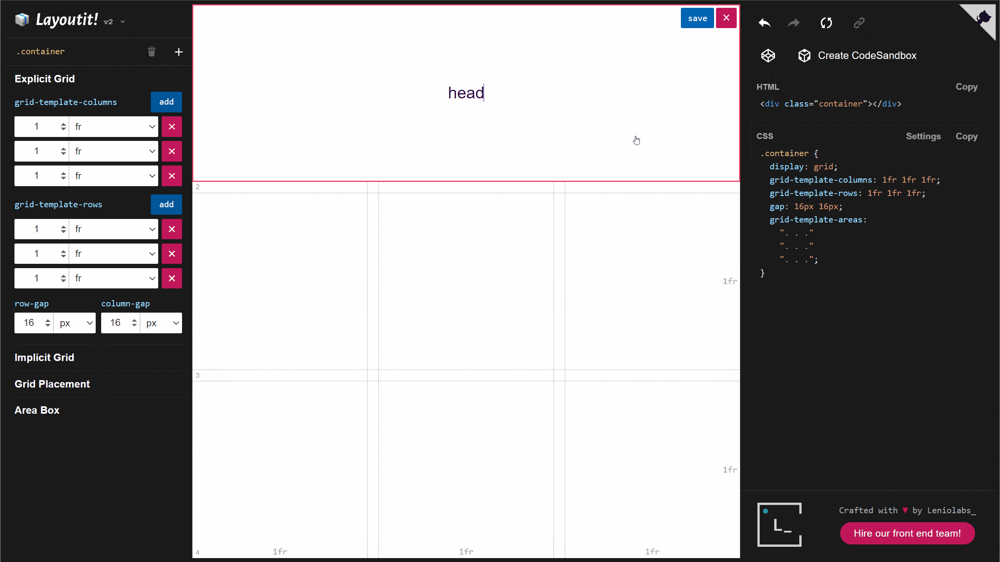
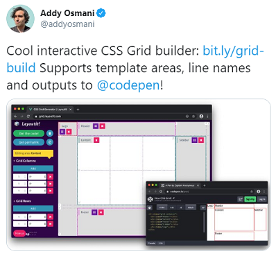
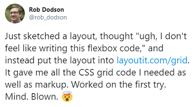

# Layoutit Grid

_CSS Grids layouts made easy!_

_Layoutit grid_ is a CSS Grid layout generator. Quickly design web pages layouts with our clean editor, and get HTML and CSS code to quickstart your next project.

**Read about the process of [Open Sourcing Layoutit Grid, and why we are using Vue 3 and Vite](https://leniolabs.com/software/development/2020/09/23/open-source-layoutit.html?utm_source=layoutit&utm_medium=banner&utm_campaign=leniolabs&utm_content=grid_github)** :heart:

## Use the tool

Go to https://grid.layoutit.com/ and start playing :dart:



This App is not currently intended to be used as a library, but may in the future. The package in npm is just a placeholder to help discovering the github repository at this point.

## Why we built a Generator

Generators can be a stepping stone when you are learning new concepts. Layoutit Grid helps you experience the power of CSS Grid by materializing your designs in a few clicks along with the code to make it happen. This gives you the early wins that you need to push forward with the learning process. For some of us, generators permanently remain in our toolboxes. Not because we do not know how to craft the layouts by hand, but because having the visual feedback loop help us to quickly convert our ideas into code. So we keep playing with them.

Read more about [learning CSS Grid visually with a generator here](https://css-tricks.com/layoutit-grid-learning-css-grid-visually-with-a-generator/)

## Run it locally

These instructions will get you a copy of the project up and running on your local machine for development

### Clone the repo

Use ssh

```bash
git clone git@github.com:Leniolabs/layoutit-grid.git
```

Or https

```bash
git clone https://github.com/leniolabs/layoutit-grid.git
```
### Run it
1. Install `pnpm` (https://pnpm.io/installation)
2. In the repo folder run
```bash
pnpm install
pnpm start
```

Your dev server will start and be running at

```bash
  > Local:    http://localhost:3000/
```

#### Commands

| Command         | Description                   |
| --------------- | ----------------------------- |
| `pnpm install`   | Install the dependencies      |
| `pnpm start`     | Run the project (in dev mode) |
| `pnpm run build` | Build for deployment          |

## Contributing

[Ideas](https://github.com/leniolabs/layoutit-grid/issues/new), pull requests and bug reports are welcome.

## Libs and Tools used

- [Vue 3](https://v3.vuejs.org) Vue.js - The Progressive JavaScript Framework.
- [Vueuse](https://vueuse.js.org/) Collection of essential Vue Composition Utilities
- [Vite](https://github.com/vitejs/vite) Next generation frontend tooling. It's fast!
- [vite-plugin-pwa](https://github.com/antfu/vite-plugin-pwa) Zero-config PWA for Vite
- [vite-plugin-components](https://github.com/antfu/vite-plugin-components) On demand components auto importing for Vite

## Mentions

<a href="https://twitter.com/addyosmani/status/1222104530038296578"></a>
<br>
<br>
<a href="https://twitter.com/rob_dodson/status/1010303563514310656"></a>

## Creators

Layoutit grid is crafted with love by [Leniolabs](https://www.leniolabs.com/services/team-augmentation/?utm_source=layoutit&utm_medium=banner&utm_campaign=leniolabs&utm_content=grid_github) and a growing community of contributors. We build digital experiences with your ideas. [Get in touch!](https://www.leniolabs.com/services/team-augmentation/?utm_source=layoutit&utm_medium=banner&utm_campaign=leniolabs&utm_content=grid_github)